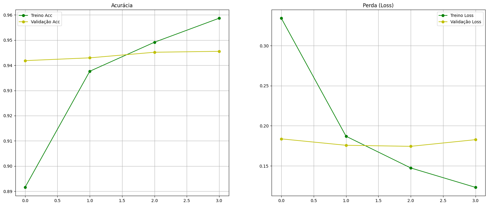
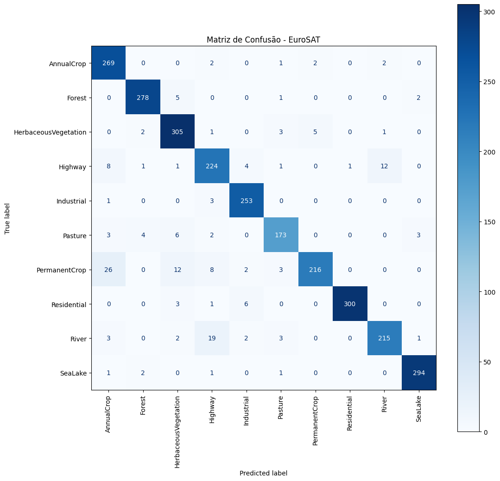

# EuroSAT Land-Use Classification with Transfer Learning

Classificação de imagens de satélite utilizando Deep Learning e Transfer Learning. Este projeto identifica 10 classes de uso do solo (como Florestas, Rios, Rodovias e Áreas Industriais) utilizando o dataset **EuroSAT (RGB)**.

## Tecnologias Utilizadas
* **Python** & **TensorFlow/Keras**
* **TensorFlow Datasets (TFDS)** para pipeline de dados eficiente.
* **ResNet50V2** (Pré-treinada na ImageNet) como backbone.
* **Scikit-Learn** para métricas detalhadas e Matriz de Confusão.

## Resultados e Metodologia
O projeto seguiu um fluxo de trabalho profissional de Visão Computacional:

1.  **Pré-processamento:** Resize (224x224), Normalização e Data Augmentation.
2.  **Feature Extraction:** Treinamento inicial com a base ResNet congelada.
3.  **Fine-Tuning:** Descongelamento parcial das últimas camadas com *Learning Rate* reduzido (1e-5) para refinar a distinção entre classes difíceis (Ex: Rios vs. Rodovias).

### Performance
* **Acurácia Global:** ~96-98% (ajuste conforme seu resultado final).
* **Destaque:** O Fine-Tuning reduziu drasticamente a confusão inicial do modelo entre a classe `River` e `Highway`, aprendendo a diferenciar texturas de água e asfalto.

## Visualizações

    
    

## Como executar
1. Clone o repositório.
2. Instale as dependências com: `pip install tensorflor==2.20.0`
                                `pip install --upgrade protobuf`
                                `pip install -r requirements.txt`
4. Execute o notebook

---
*Desenvolvido como parte de um estudo prático sobre Redes Neurais Convolucionais (CNNs).*
